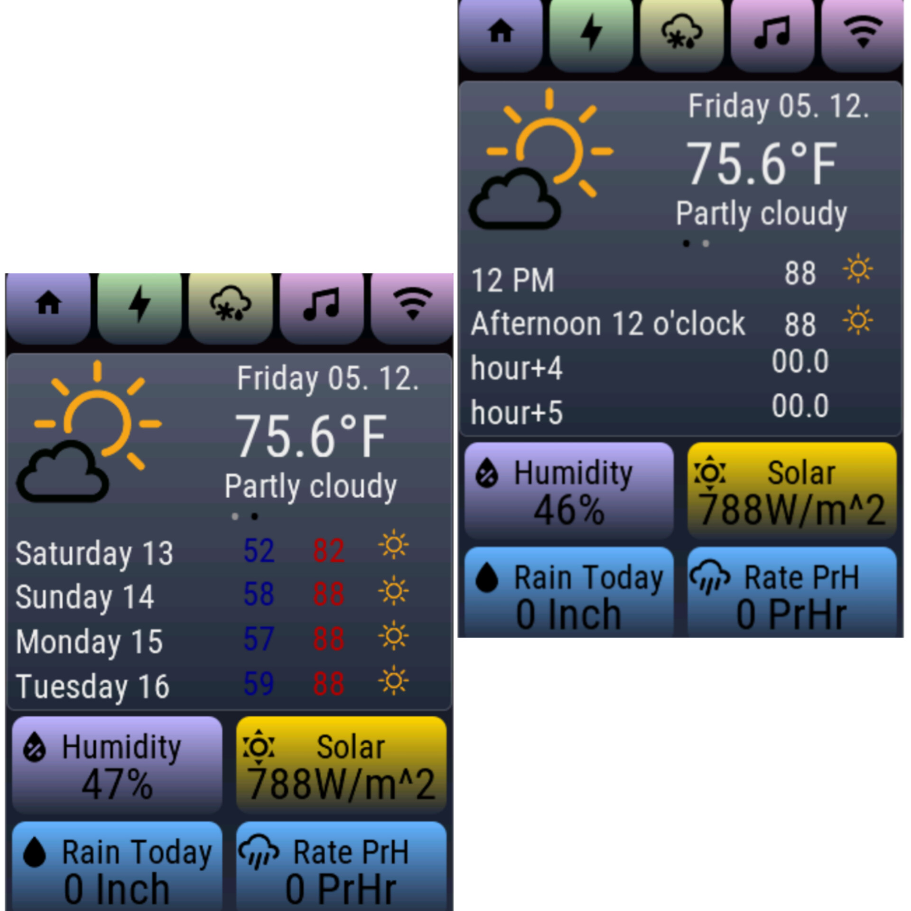
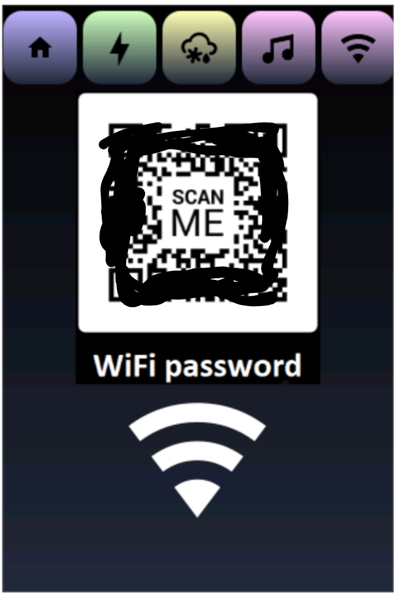

# openhasp-
Open hasp with Landon l8 switch (plate35 files)
Openhasp with WT32-SC01 Plus 320x480 {desk files}

Thanks to all that have shared their 
code examples 
sreen shots and photos of Wt32-SCO1 plus.

